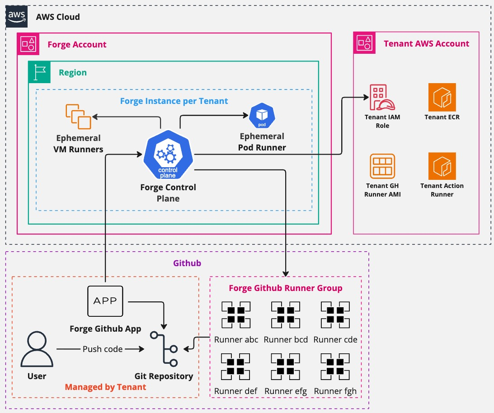
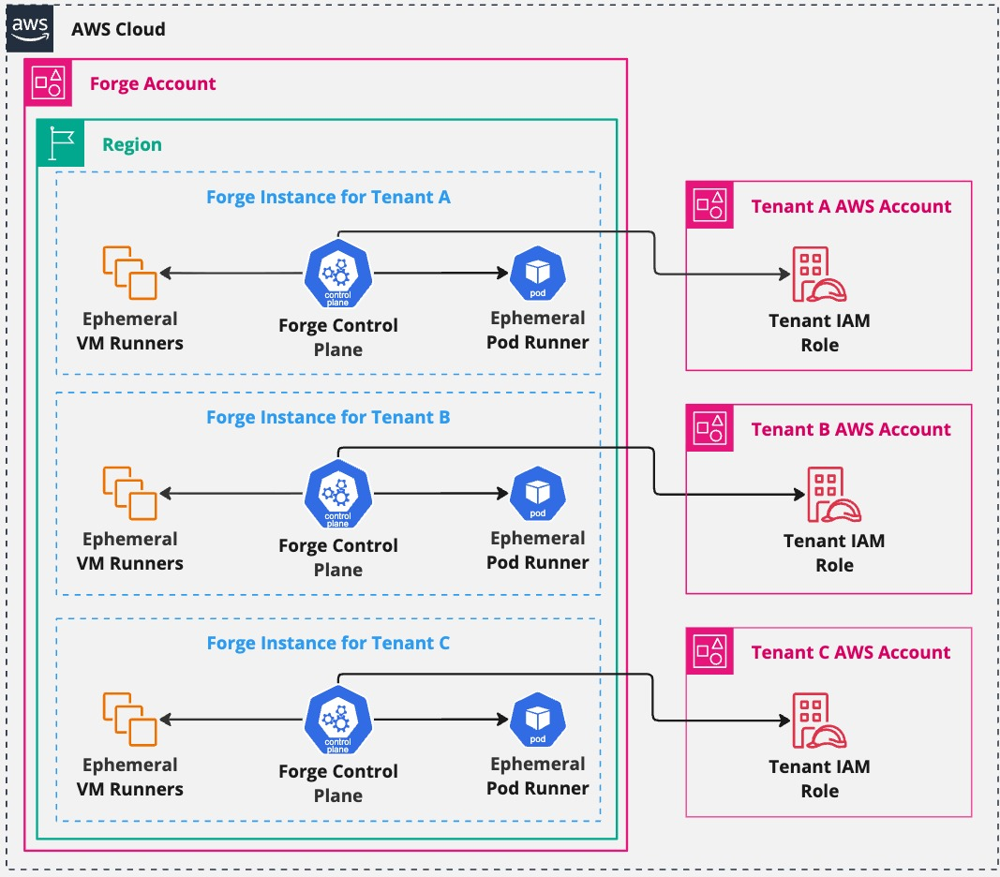
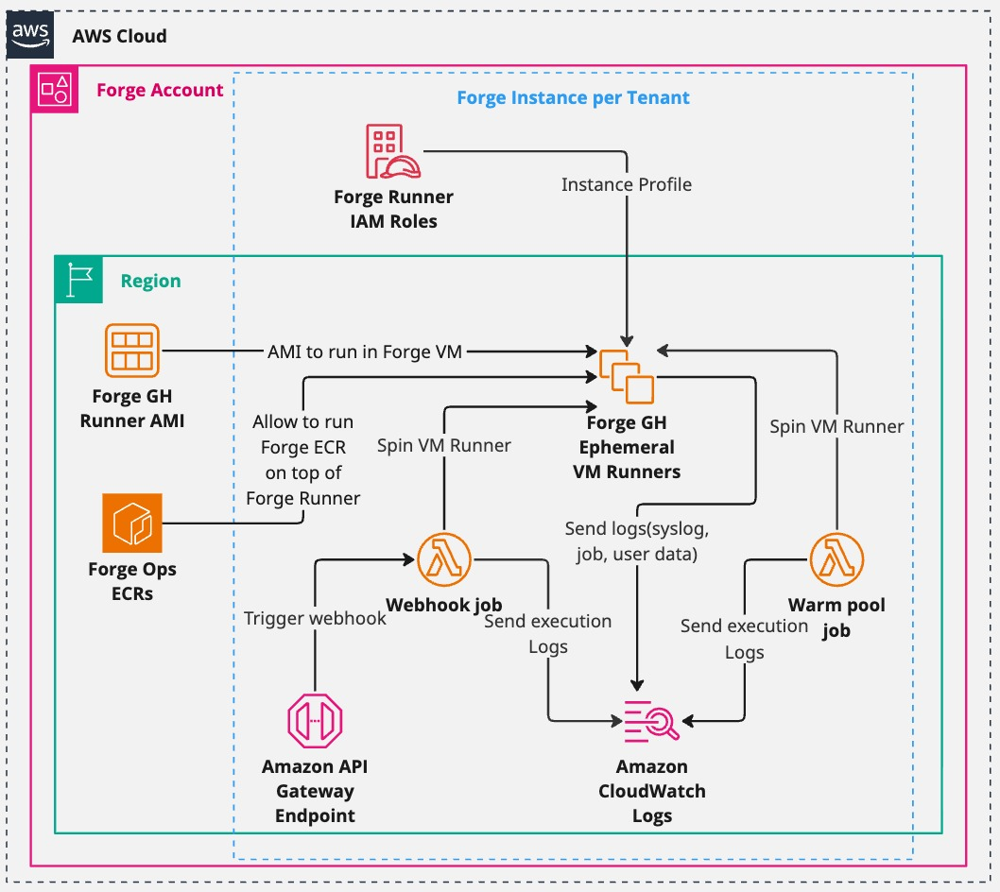
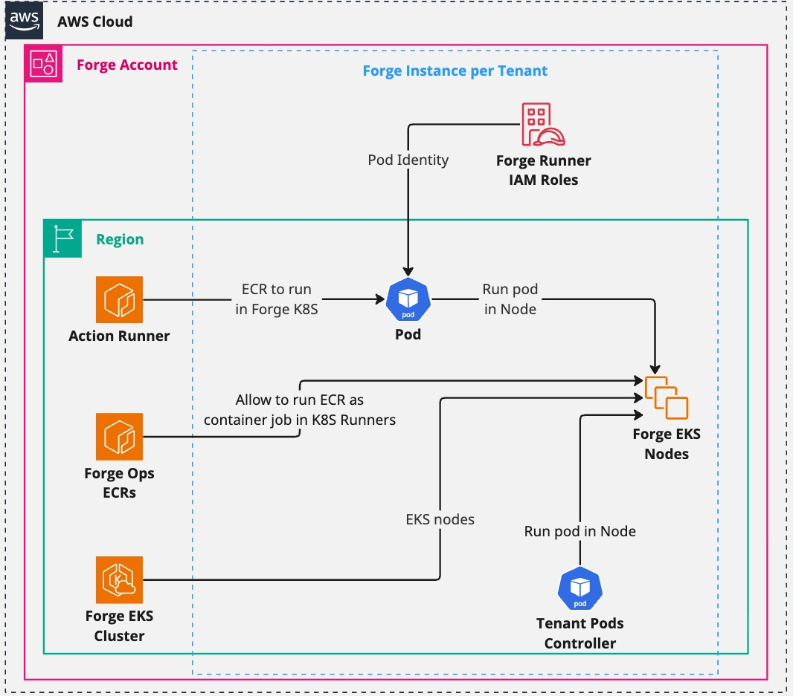
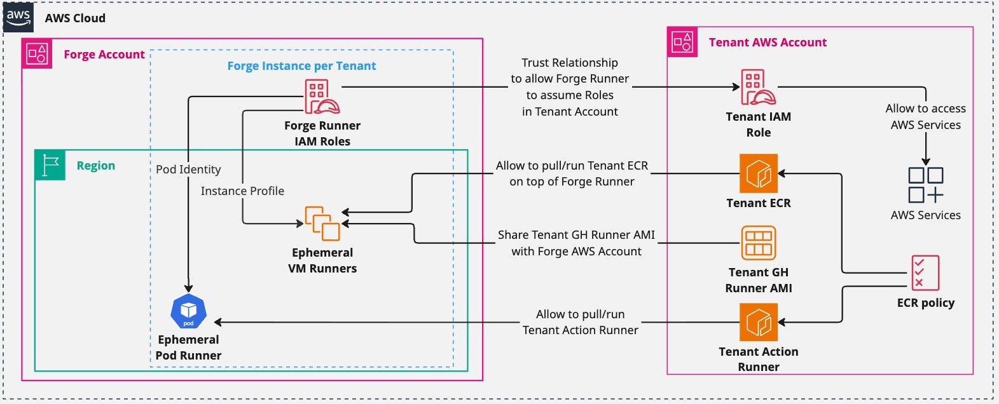

# ForgeMT

[](https://github.com/cisco-open/forge/releases/latest/)
[](LICENSE.md)
[](https://opensource.cisco.com)


[](https://github.com/cisco-open/forge/graphs/contributors)

______________________________________________________________________

## What is ForgeMT

ForgeMT is an **enterprise-grade GitHub Actions runner platform for AWS**.
It provides:

- **Secure multi-tenancy** using IAM/OIDC and network segmentation
- **Ephemeral EC2 and Kubernetes runners** for cost-efficient scaling
- **Full automation** for onboarding, GitHub App management, and lifecycle updates
- **Built-in observability** and governance

ForgeMT allows organizations running **thousands of CI/CD pipelines daily** to scale without hitting performance, cost, or security limits.



______________________________________________________________________

## Who Should Use ForgeMT?

ForgeMT is ideal for organizations that:

- Run 100+ CI/CD jobs daily across multiple teams
- Need stricter security controls than GitHub hosted runners
- Want to reduce runner costs while maintaining performance
- Require custom environments or access to internal AWS resources

______________________________________________________________________

## Key Benefits

- **Secure Multi-Tenant Isolation:** Strong boundaries without fragmenting infrastructure. Short-lived IAM roles via OIDC replace static secrets.
- **Cost Optimization:** Spot instances, scale-to-zero, warm pools, and optimized pod sizing.
- **Full Automation:** Zero-touch operations for onboarding, updates, and configuration.
- **Open Source:** Fully transparent, adaptable, and vendor-neutral.

______________________________________________________________________

## How It Compares

| Solution          | Cost             | Security     | Maintenance | Custom Env |
| ----------------- | ---------------- | ------------ | ----------- | ---------- |
| GitHub Hosted     | High volume cost | Standard     | None        | Limited    |
| Basic Self-Hosted | EC2 costs        | Manual setup | High        | Full       |
| **ForgeMT**       | Optimized        | Enterprise   | Low         | Full       |

______________________________________________________________________

## Architecture Overview

ForgeMT separates the **control plane** from the **tenant plane**:

- **Control Plane:**
  Manages the deployment, provisioning, scaling, and monitoring of all runners. Built with OpenTofu/Terraform, Helm (ARC), and centralized IAM/OIDC, it ensures automated and secure operations across tenants.

- **Tenant Plane:**
  Runs ephemeral CI/CD jobs. Tenants access their AWS resources via **short-lived IAM roles** using OIDC trust relationships. All runners are **automatically deployed by the control plane**, and tenants do not manage them directly.

  Supported runner types:

  - **EC2 runners:** Full VM control, custom AMIs, per-tenant sandboxes.
  - **EKS runners (ARC):** Containerized workloads in per-tenant namespaces. Uses Calico CNI to optimize IP allocation for large-scale deployments.

**Architecture Diagrams:**


*High-level view of ForgeMT multi-tenant architecture.*


*Deployment and lifecycle of EC2 runners.*


*Deployment and lifecycle of EKS (ARC) runners.*


*Tenant plane showing ephemeral runner usage and IAM/OIDC access.*

______________________________________________________________________

## Runner Types

| Type          | Use Case                      | Isolation                                              | Scaling                  |
| ------------- | ----------------------------- | ------------------------------------------------------ | ------------------------ |
| **EC2**       | Full VM control, custom AMIs  | Per-tenant sandbox in shared AWS accounts via IAM/OIDC | EC2 ASG + Spot/On-Demand |
| **EKS (ARC)** | Burst workloads in containers | Per-tenant namespace (optionally node-isolated)        | Karpenter + ARC          |

______________________________________________________________________

## Two User Personas

### 🔧 **Platform Administrator**

- **Role:** Deploy and maintain ForgeMT infrastructure
- **Responsibilities:** AWS account setup, tenant provisioning, platform updates
- **Tools:** Terraform/OpenTofu, AWS CLI, kubectl
- **Workflow:** Deploy control plane → Onboard tenants → Monitor platform

### 👩‍💻 **Development Team (Tenant)**

- **Role:** Use ForgeMT runners for CI/CD pipelines
- **Responsibilities:** Configure workflows, manage GitHub Apps, consume runners
- **Tools:** GitHub Actions YAML, GitHub CLI (optional)
- **Workflow:** Request access → Configure workflows → Run CI/CD jobs

______________________________________________________________________

## Quick Start

### For Platform Administrators

Deploy and manage the ForgeMT infrastructure:

- **[Deploy Your First Tenant](./docs/configurations/deployments/forge_tenant.md)** — Minimal setup to bootstrap ForgeMT.
- **[All Deployment Scenarios](./docs/configurations/deployments/index.md)** — Includes EKS, Splunk, BYO AMIs, and advanced patterns.

**Prerequisites:** AWS CLI configured, Terraform 1.5+, kubectl

### For Development Teams (Tenants)

Use ForgeMT runners in your GitHub Actions workflows:

- **[Tenant Usage Guide](./docs/tenant-usage/index.md)** — Onboarding, GitHub App setup, and day-2 operations.

______________________________________________________________________

## Sample Tenant Usage

Once onboarded by an admin, tenants use ForgeMT runners like this:

```yaml
# .github/workflows/ci.yml
name: CI Pipeline
on: [push, pull_request]

jobs:
  test:
    runs-on: forge-ec2-medium  # Your ForgeMT runner
    permissions:
      id-token: write  # Required for OIDC
    steps:
      - uses: actions/checkout@v4

      - name: Configure AWS Credentials
        uses: aws-actions/configure-aws-credentials@v4
        with:
          role-to-assume: ${{ vars.AWS_ROLE_ARN }}
          aws-region: us-west-2

      - name: Run tests with AWS access
        run: |
          # Your CI/CD commands here
          # Full access to AWS resources via OIDC
          aws s3 ls
          docker build -t myapp .
```

**Key Benefits for Tenants:**

- 🔒 **Secure AWS access** without storing secrets
- ⚡ **Custom instance types** (EC2) or **fast container startup** (EKS)
- 💰 **Cost-efficient** with auto-scaling and spot instances
- 🛠️ **Zero maintenance** - admins handle all infrastructure

______________________________________________________________________

## Core Features

| Feature                 | Description                                      |
| ----------------------- | ------------------------------------------------ |
| Ephemeral Runners       | Auto-scaling EC2/EKS runners with zero idle cost |
| Tenant Isolation        | Secure IAM + OIDC + VPC per tenant/project       |
| Zero-Touch Operations   | Automatic patching, upgrades, drift remediation  |
| Observability           | Logs, metrics, dashboards per tenant             |
| Cost Optimization       | Spot, scale-to-zero, warm pools                  |
| Flexible Infrastructure | BYO AMIs, VPCs, subnets, instance types          |
| Multi-Runner Support    | Mix EC2 and EKS in one deployment                |
| GitHub Cloud & GHES     | Works with SaaS and on-prem GitHub setups        |

______________________________________________________________________

## Learn More

- [Technical Case Study](https://www.linkedin.com/pulse/forge-scalable-secure-multi-tenant-github-runner-brilhante--fyxbf)
- [Full Documentation](./docs/configurations/index.md)

______________________________________________________________________

## Contributing

Contributions are welcome via issues or pull requests. See [CONTRIBUTING.md](CONTRIBUTING.md) for details.

______________________________________________________________________

## Acknowledgements

Built on top of:

- [terraform-aws-github-runner](https://github.com/github-aws-runners/terraform-aws-github-runner)
- [actions-runner-controller](https://github.com/actions/actions-runner-controller)

______________________________________________________________________

## License

Apache 2.0 — see [LICENSE](LICENSE)

______________________________________________________________________

## Contact

Track progress or open issues on GitHub:
[https://github.com/cisco-open/forge/issues](https://github.com/cisco-open/forge/issues)
