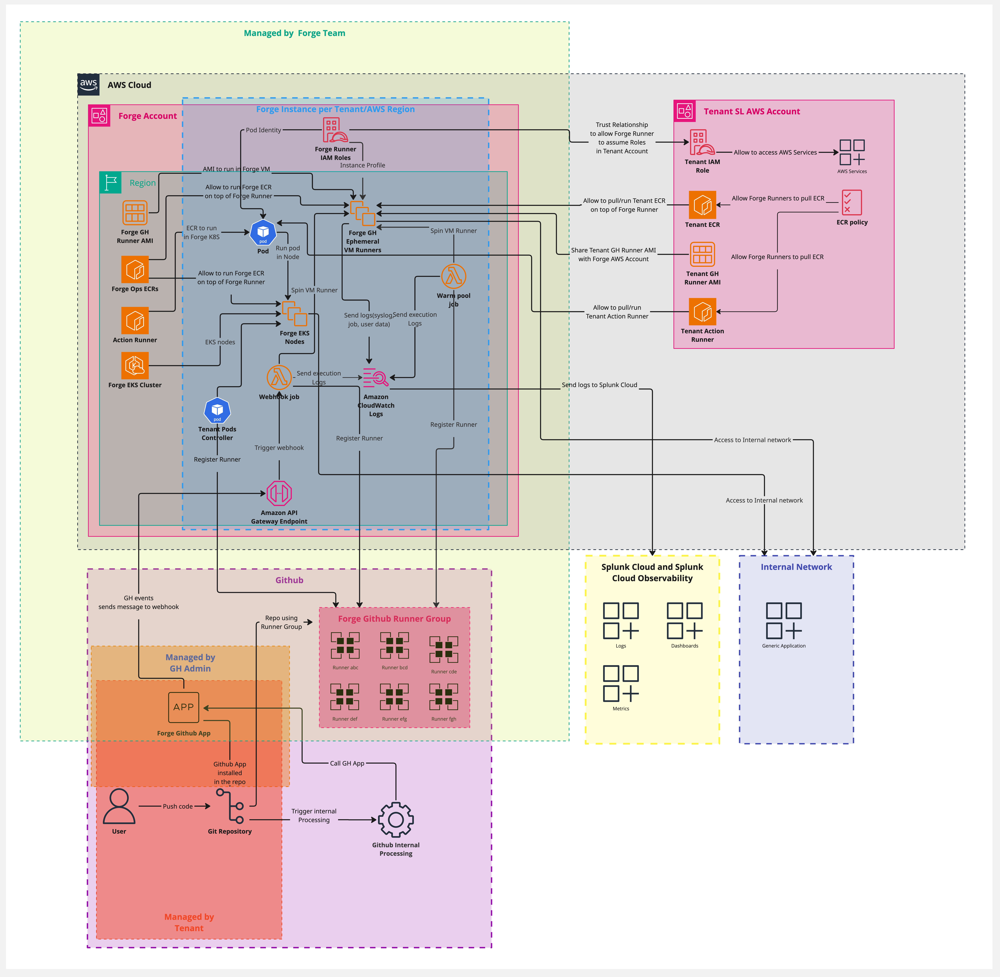

# Forge Multi-Tenant CI/CD Solution

## Table of Contents

<!-- toc -->

- [Forge Multi-Tenant CI/CD Solution](#forge-multi-tenant-cicd-solution)
  - [Table of Contents](#table-of-contents)
  - [Overview](#overview)
  - [🚀 Features \& Architecture](#-features--architecture)
  - [🏗️ Getting Started](#️-getting-started)
    - [📌 Prerequisites](#-prerequisites)
    - [⚙️ Installation](#️-installation)
      - [🚀 Deploy GitHub Runners on AWS EC2](#-deploy-github-runners-on-aws-ec2)
      - [🏗️ Deploy GitHub Runners on Kubernetes Pods](#️-deploy-github-runners-on-kubernetes-pods)
  - [🔄 Dependency Management](#-dependency-management)
  - [⚙️ Configuration](#️-configuration)
    - [🖥️ EC2 Runner Types](#️-ec2-runner-types)
      - [🏗️ Available EC2 Instances](#️-available-ec2-instances)
    - [☸️ Kubernetes Runner Types](#️-kubernetes-runner-types)
    - [🛠️ Custom Runner Types(VM or K8S)](#️-custom-runner-typesvm-or-k8s)
  - [🔐 Optional AWS Access for Runners](#-optional-aws-access-for-runners)
    - [⚙️ Configuring AWS Access (Optional)](#️-configuring-aws-access-optional)
    - [🔄 Example: Assume Role in External AWS Account (Optional)](#-example-assume-role-in-external-aws-account-optional)
    - [🐳 Running Jobs in Containers](#-running-jobs-in-containers)
      - [1. **Create an ECR Policy for the Forge Runner**](#1-create-an-ecr-policy-for-the-forge-runner)
      - [2. **Attach the Policy to the Forge Runner IAM Role**](#2-attach-the-policy-to-the-forge-runner-iam-role)
      - [3. **Configure the Runner to Access the ECR Repository**](#3-configure-the-runner-to-access-the-ecr-repository)
  - [🔍 Observation](#-observation)
  - [🔧 How to Configure a Repository for Runners](#-how-to-configure-a-repository-for-runners)
    - [1. Navigate to the Repository](#1-navigate-to-the-repository)
    - [2. Access Configuration Options](#2-access-configuration-options)
    - [3. Select Repositories](#3-select-repositories)
    - [5. Ready for Runners](#5-ready-for-runners)

<!-- tocstop -->

## Overview

Forge Multi-Tenant provides a managed solution for running GitHub Runners on AWS EC2 instances and Kubernetes pods within the Forge account. These runners come pre-configured, eliminating the need for teams to manage infrastructure. They dynamically scale workflows and, if needed, interact with external AWS resources like EC2, DynamoDB, S3, and Secrets Manager.

By default, Forge runners operate in isolation. However, if a team requires access to an external AWS account, **IAM role-based access** can be configured to grant controlled permissions.

Forge also supports **secure SSH access via Teleport** for remote debugging and troubleshooting. Additionally, **logs are automatically sent to Splunk**, ensuring centralized observability and monitoring.

## 🚀 Features & Architecture



Forge is designed for flexible, secure, and scalable CI/CD operations, integrating seamlessly with GitHub Actions. Key features include:

- ⚡ **Flexible Scaling**: Choose from predefined runner types (`dependabot`, `small`, `standard`, `large`, `metal`) to match workload needs.
- 🐳 **Container Support**: Run jobs in Docker containers for isolated execution.
- 🔐 **IAM Role-Based Access**: Securely access external AWS accounts with per-tenant IAM roles, ensuring strict permission control.
- 🖥️ **Secure Remote Access**: Enable SSH access via Teleport for debugging and troubleshooting.
- 📊 **Centralized Logging & Monitoring**: Automatically send logs to Splunk and integrate with CloudWatch for monitoring.
- 🔄 **Seamless GitHub Actions Integration**: Optimize CI/CD workflows effortlessly.
- 📦 **Automated Dependency Management**: Utilize **Dependabot** and **Renovate Bot** for automated updates.

---

## 🏗️ Getting Started

### 📌 Prerequisites

- ✅ GitHub account with repository access.
- 🔗 (Optional) External AWS account for accessing additional resources.
- 🔑 (Optional) IAM roles in the external AWS account for controlled access.

### ⚙️ Installation

#### 🚀 Deploy GitHub Runners on AWS EC2

1. **Pre-Deployed Runners**: EC2 instances are pre-deployed in the Forge account.
2. **Request Specific Instance Types**: Teams can request different EC2 instance types.
3. **Configure GitHub Workflow**: Add the following configuration to `.github/workflows/your-workflow.yml`:

   ```yaml
   jobs:
     build:
       name: Build on Forge
       runs-on:
         - self-hosted
         - x64
         - type: large
         - env: ops-prod
   ```

#### 🏗️ Deploy GitHub Runners on Kubernetes Pods

1. **Pre-Deployed Pods**: Kubernetes pods are available in the Forge-managed cluster.
2. **Request Specific Pod Types**: Teams can request different pod configurations.
3. **Configure GitHub Workflow**:

   ```yaml
   jobs:
     build:
       name: Build on Forge
       runs-on:
         - k8s
   ```

---

## 🔄 Dependency Management

Forge supports automated dependency updates using **Dependabot** and **Renovate Bot**:

- 🤖 **Dependabot**: A GitHub-native tool that creates PRs to update dependencies automatically.
- 🔧 **Renovate Bot**: Offers advanced versioning strategies, scheduling, and fine-grained configuration.

[See the detailed comparison guide](./docs/dependency-management.md).

---

## ⚙️ Configuration

### 🖥️ EC2 Runner Types

Forge Multi-Tenant provides four predefined EC2 runner types:

| Type    | Purpose |
|---------|---------|
| 🟢 `small` | Lightweight tasks with minimal resource usage. |
| 🔵 `standard` | Balanced workloads requiring moderate resources. |
| 🟠 `large` | High-performance workloads needing more compute power. |
| 🔴 `metal` | Bare-metal instances for resource-intensive applications. |

#### 🏗️ Available EC2 Instances

- 🟢 **small**: `t2.small`, `t2.medium`, `t3.small`, `t3.medium`, `t3.large`
- 🔵 **standard**: `t3.medium`, `t3.large`, `t3.xlarge`, `m5.large`, `m5.xlarge`
- 🟠 **large**: `c6i.8xlarge`, `c5.9xlarge`, `c6i.12xlarge`, `c6i.16xlarge`
- 🔴 **metal**: `c6i.metal`, `m6i.metal`, `r6i.metal`

[View the full list of AWS instance types](https://instances.vantage.sh/aws/ec2/).

### ☸️ Kubernetes Runner Types

Forge provides three Kubernetes-based runner types:

| Type       | Purpose |
|------------|---------|
| 🤖 `dependabot` | Used for automatic Dependabot jobs. |
| ☸️ `k8s`       | Runs lightweight jobs, excluding Docker-based actions. |
| 🐳 `dind`      | Runs jobs requiring Docker-in-Docker (DinD) in rootless mode. |

### 🛠️ Custom Runner Types(VM or K8S)

Tenants may request custom runner types to suit specific workload requirements beyond the predefined options. Custom runner types can be tailored to meet unique performance, configuration, or resource needs. To request a custom runner type, tenants should contact the Forge support team with specific details about their requirements.

---

## 🔐 Optional AWS Access for Runners

By default, Forge Runners do not require access to external AWS resources. However, if a team needs the runner to interact with resources (e.g., launch EC2 instances, access DynamoDB, S3, or Secrets Manager), **IAM role-based access** can be configured.

### ⚙️ Configuring AWS Access (Optional)

To allow the runner to access external AWS resources:

1. **External AWS IAM Role (Optional)**: The external AWS account must have IAM roles configured with the necessary permissions (e.g., EC2, DynamoDB, S3).
2. **Trust Relationship**: The external AWS role must trust the IAM role from the Forge account to allow the Forge runner to assume it.

### 🔄 Example: Assume Role in External AWS Account (Optional)

To configure role assumption, the external AWS account must allow the Forge runner's role to assume its IAM role:

```json
{
  "Version": "2012-10-17",
  "Statement": [
    {
      "Effect": "Allow",
      "Action": "sts:AssumeRole",
      "Resource": "arn:aws:iam::EXTERNAL_AWS_ACCOUNT_ID:role/ForgeRunnerRole"
    }
  ]
}
```

Once the Forge runner assumes this role, it will have the permissions defined in the external AWS account’s IAM role (e.g., to launch EC2 instances, access S3, pull ECR, etc.).

### 🐳 Running Jobs in Containers

If your runner's AMI does not contain the necessary tools, you can run your job inside a Docker container.

To allow the Forge runner to pull a Docker image from Amazon ECR, you’ll need to create an ECR policy in the AWS account hosting the ECR repository. This policy should grant permissions to the Forge runner (or the IAM role it assumes) to pull images from ECR.

#### 1. **Create an ECR Policy for the Forge Runner**

First, you need to create a policy that allows the Forge runner to pull images from your ECR repository.

Example ECR policy (JSON format):

```json
{
  "Version": "2012-10-17",
  "Statement": [
    {
      "Effect": "Allow",
      "Action": [
        "ecr:GetAuthorizationToken",
        "ecr:BatchGetImage"
      ],
      "Resource": "arn:aws:ecr:<aws-region>:<aws-account-id>:repository/<container-name>"
    }
  ]
}
```

In the policy:
- Replace `<aws-region>` with the AWS region where the ECR repository is located.
- Replace `<aws-account-id>` with the AWS account ID that owns the ECR repository.
- Replace `<container-name>` with the name of the container repository in ECR.

#### 2. **Attach the Policy to the Forge Runner IAM Role**

Attach this policy to the IAM role that the Forge runner uses to interact with AWS resources. This will allow the runner to authenticate and pull the container image from your ECR repository.

#### 3. **Configure the Runner to Access the ECR Repository**

Ensure that the Forge runner is configured to authenticate against the ECR repository. Typically, this would involve setting up the AWS credentials, which the runner can use to assume the IAM role with the ECR pull permissions.

The job definition in GitHub Actions will look like this:

```yaml
jobs:
  my-job:
    runs-on:
      - self-hosted
      - x64
      - type: small
      - env: ops-prod
    timeout-minutes: 60

    container:
      image: <aws-account-id>.dkr.ecr.<aws-region>.amazonaws.com/<container-name>
```

Make sure that the runner has the necessary IAM role attached to it, as described, for pulling from the private ECR repository. This ensures that the runner can retrieve the image before executing the job.

---

## 🔍 Observation

-- **Instance Selection**: Forge will attempt to provision the smallest available instance within the requested forge type, depending on availability in the AWS region.
-- **Network Latency**: When using containers from an ECR in a different AWS region than the runner, expect some network latency during image pulls.

---

## 🔧 How to Configure a Repository for Runners

### 1. Navigate to the Repository
Go to a repository that already has the **GitHub App for the tenant** installed.  

### 2. Access Configuration Options
- Click on **Configure** within the repository settings.  
- This will redirect you to a page where you can select new repositories to install the application.  

### 3. Select Repositories
- Choose the repositories you want to install the GitHub App on.  
- If you need the app available across multiple repositories, ensure you select all the required repositories.  

### 5. Ready for Runners
Once approved, the repository is configured and ready to use the runners associated with the GitHub App.  

--
