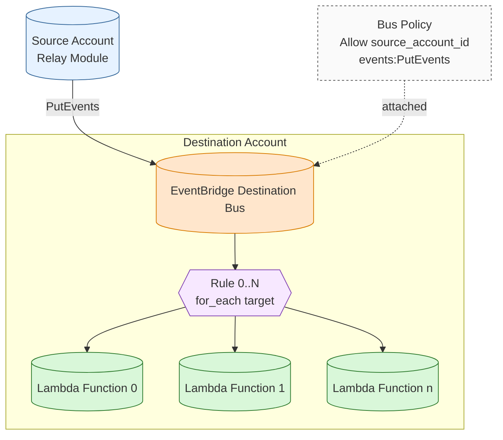

# Webhook Relay Destination Module

Creates the destination EventBridge bus, grants the source account permission to PutEvents, and wires multiple (or single) Lambda targets via per‑rule event patterns.

## Architecture

<!-- BEGIN_TF_DOCS -->
## Requirements

| Name | Version |
|------|---------|
|  [terraform](#requirement\_terraform) | >= 1.10 |
|  [aws](#requirement\_aws) | >= 6.25 |
|  [external](#requirement\_external) | >= 2.3 |

## Providers

| Name | Version |
|------|---------|
|  [aws](#provider\_aws) | 6.25.0 |
|  [external](#provider\_external) | 2.3.5 |

## Modules

No modules.

## Resources

| Name | Type |
|------|------|
| [aws_cloudwatch_event_bus.destination](https://registry.terraform.io/providers/hashicorp/aws/latest/docs/resources/cloudwatch_event_bus) | resource |
| [aws_cloudwatch_event_bus_policy.allow_source](https://registry.terraform.io/providers/hashicorp/aws/latest/docs/resources/cloudwatch_event_bus_policy) | resource |
| [aws_cloudwatch_event_rule.receive](https://registry.terraform.io/providers/hashicorp/aws/latest/docs/resources/cloudwatch_event_rule) | resource |
| [aws_cloudwatch_event_target.lambda](https://registry.terraform.io/providers/hashicorp/aws/latest/docs/resources/cloudwatch_event_target) | resource |
| [aws_iam_role.reader](https://registry.terraform.io/providers/hashicorp/aws/latest/docs/resources/iam_role) | resource |
| [aws_iam_role_policy.allow_assume_external_inline](https://registry.terraform.io/providers/hashicorp/aws/latest/docs/resources/iam_role_policy) | resource |
| [aws_lambda_permission.eventbridge_invoke](https://registry.terraform.io/providers/hashicorp/aws/latest/docs/resources/lambda_permission) | resource |
| [aws_iam_policy_document.allow_assume_external](https://registry.terraform.io/providers/hashicorp/aws/latest/docs/data-sources/iam_policy_document) | data source |
| [aws_iam_policy_document.trust](https://registry.terraform.io/providers/hashicorp/aws/latest/docs/data-sources/iam_policy_document) | data source |
| [external_external.fetch_secret_value](https://registry.terraform.io/providers/hashicorp/external/latest/docs/data-sources/external) | data source |

## Inputs

| Name | Description | Type | Default | Required |
|------|-------------|------|---------|:--------:|
|  [aws\_profile](#input\_aws\_profile) | AWS profile to use. | `string` | n/a | yes |
|  [aws\_region](#input\_aws\_region) | AWS region to use. | `string` | n/a | yes |
|  [default\_tags](#input\_default\_tags) | n/a | `map(string)` | n/a | yes |
|  [reader\_config](#input\_reader\_config) | Configuration for IAM role creation and secret retrieval | <pre>object({     role_name              = string     role_trust_principals  = list(string)     source_secret_role_arn = string     enable_secret_fetch    = bool     source_secret_arn      = string     source_secret_region   = string   })</pre> | <pre>{   "enable_secret_fetch": false,   "role_name": "github-webhook-relay-secret-reader",   "role_trust_principals": [],   "source_secret_arn": "",   "source_secret_region": "",   "source_secret_role_arn": "" }</pre> | no |
|  [tags](#input\_tags) | n/a | `map(string)` | `{}` | no |
|  [webhook\_relay\_destination\_config](#input\_webhook\_relay\_destination\_config) | All configuration for the destination EventBridge relay | <pre>object({     name_prefix                = string     destination_event_bus_name = string     source_account_id          = string     targets = list(object({       event_pattern       = string       lambda_function_arn = string     }))   })</pre> | <pre>{   "destination_event_bus_name": "webhook-relay-destination",   "name_prefix": "webhook-relay-destination",   "source_account_id": "",   "targets": [] }</pre> | no |

## Outputs

| Name | Description |
|------|-------------|
|  [role\_arn](#output\_role\_arn) | Local role ARN. |
|  [webhook](#output\_webhook) | Webhook relay and secret fetched from source account. |
<!-- END_TF_DOCS -->
