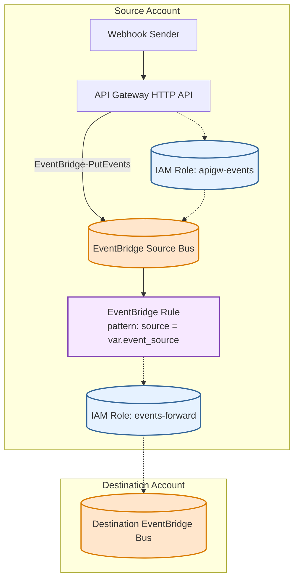

# Webhook Relay Module

Ingest arbitrary HTTPS webhook POSTs and forward them (optionally cross‑account) via EventBridge.

## Architecture


## Usage
```hcl
module "webhook_relay" {
  source                    = "./source"
  name_prefix               = "webhook-relay-src"
  source_event_bus_name     = "webhook-relay-source"
  event_source              = "webhook.relay"
  destination_account_id    = "123456789012"
  destination_event_bus_name= "central-bus"
  destination_region        = "us-east-1"
  tags = {
    app = "webhook-relay"
    env = "dev"
  }
}
```

After apply, use:
```
curl -X POST "$(terraform output -raw webhook_endpoint)/webhook" \
  -H "Content-Type: application/json" \
  -d '{"hello":"world"}'
```

<!-- BEGIN_TF_DOCS -->
## Requirements

| Name | Version |
|------|---------|
| <a name="requirement_terraform"></a> [terraform](#requirement\_terraform) | >= 1.9.1 |
| <a name="requirement_aws"></a> [aws](#requirement\_aws) | >= 5.90 |

## Providers

| Name | Version |
|------|---------|
| <a name="provider_aws"></a> [aws](#provider\_aws) | 6.19.0 |

## Modules

| Name | Source | Version |
|------|--------|---------|
| <a name="module_validate_signature_lambda"></a> [validate\_signature\_lambda](#module\_validate\_signature\_lambda) | terraform-aws-modules/lambda/aws | 8.1.0 |

## Resources

| Name | Type |
|------|------|
| [aws_apigatewayv2_api.webhook](https://registry.terraform.io/providers/hashicorp/aws/latest/docs/resources/apigatewayv2_api) | resource |
| [aws_apigatewayv2_integration.lambda](https://registry.terraform.io/providers/hashicorp/aws/latest/docs/resources/apigatewayv2_integration) | resource |
| [aws_apigatewayv2_route.post_hook](https://registry.terraform.io/providers/hashicorp/aws/latest/docs/resources/apigatewayv2_route) | resource |
| [aws_apigatewayv2_stage.default](https://registry.terraform.io/providers/hashicorp/aws/latest/docs/resources/apigatewayv2_stage) | resource |
| [aws_cloudwatch_event_bus.source](https://registry.terraform.io/providers/hashicorp/aws/latest/docs/resources/cloudwatch_event_bus) | resource |
| [aws_cloudwatch_event_rule.forward](https://registry.terraform.io/providers/hashicorp/aws/latest/docs/resources/cloudwatch_event_rule) | resource |
| [aws_cloudwatch_event_target.dest](https://registry.terraform.io/providers/hashicorp/aws/latest/docs/resources/cloudwatch_event_target) | resource |
| [aws_cloudwatch_log_delivery.cwlogs_error_logs](https://registry.terraform.io/providers/hashicorp/aws/latest/docs/resources/cloudwatch_log_delivery) | resource |
| [aws_cloudwatch_log_delivery.cwlogs_info_logs](https://registry.terraform.io/providers/hashicorp/aws/latest/docs/resources/cloudwatch_log_delivery) | resource |
| [aws_cloudwatch_log_delivery_destination.cwlogs](https://registry.terraform.io/providers/hashicorp/aws/latest/docs/resources/cloudwatch_log_delivery_destination) | resource |
| [aws_cloudwatch_log_delivery_source.error_logs](https://registry.terraform.io/providers/hashicorp/aws/latest/docs/resources/cloudwatch_log_delivery_source) | resource |
| [aws_cloudwatch_log_delivery_source.info_logs](https://registry.terraform.io/providers/hashicorp/aws/latest/docs/resources/cloudwatch_log_delivery_source) | resource |
| [aws_cloudwatch_log_group.event_bus_logs](https://registry.terraform.io/providers/hashicorp/aws/latest/docs/resources/cloudwatch_log_group) | resource |
| [aws_cloudwatch_log_group.validate_signature_lambda](https://registry.terraform.io/providers/hashicorp/aws/latest/docs/resources/cloudwatch_log_group) | resource |
| [aws_cloudwatch_log_resource_policy.source](https://registry.terraform.io/providers/hashicorp/aws/latest/docs/resources/cloudwatch_log_resource_policy) | resource |
| [aws_iam_role.events_forward](https://registry.terraform.io/providers/hashicorp/aws/latest/docs/resources/iam_role) | resource |
| [aws_iam_role_policy.events_forward_put](https://registry.terraform.io/providers/hashicorp/aws/latest/docs/resources/iam_role_policy) | resource |
| [aws_lambda_permission.apigw_invoke](https://registry.terraform.io/providers/hashicorp/aws/latest/docs/resources/lambda_permission) | resource |
| [aws_caller_identity.current](https://registry.terraform.io/providers/hashicorp/aws/latest/docs/data-sources/caller_identity) | data source |
| [aws_iam_policy_document.cwlogs](https://registry.terraform.io/providers/hashicorp/aws/latest/docs/data-sources/iam_policy_document) | data source |
| [aws_iam_policy_document.events_forward_assume_role](https://registry.terraform.io/providers/hashicorp/aws/latest/docs/data-sources/iam_policy_document) | data source |
| [aws_iam_policy_document.events_forward_permissions](https://registry.terraform.io/providers/hashicorp/aws/latest/docs/data-sources/iam_policy_document) | data source |
| [aws_iam_policy_document.validate_signature_lambda](https://registry.terraform.io/providers/hashicorp/aws/latest/docs/data-sources/iam_policy_document) | data source |

## Inputs

| Name | Description | Type | Default | Required |
|------|-------------|------|---------|:--------:|
| <a name="input_destination_account_id"></a> [destination\_account\_id](#input\_destination\_account\_id) | Destination (receiver) AWS account ID | `string` | n/a | yes |
| <a name="input_destination_event_bus_name"></a> [destination\_event\_bus\_name](#input\_destination\_event\_bus\_name) | Destination bus name in destination account | `string` | n/a | yes |
| <a name="input_destination_region"></a> [destination\_region](#input\_destination\_region) | Destination region (omit for same as source) | `string` | `null` | no |
| <a name="input_event_source"></a> [event\_source](#input\_event\_source) | EventBridge source field for emitted events | `string` | `"webhook.relay"` | no |
| <a name="input_log_level"></a> [log\_level](#input\_log\_level) | Log level for application logging (e.g., INFO, DEBUG, WARN, ERROR) | `string` | `"INFO"` | no |
| <a name="input_logging_retention_in_days"></a> [logging\_retention\_in\_days](#input\_logging\_retention\_in\_days) | Log retention period in days | `number` | `3` | no |
| <a name="input_name_prefix"></a> [name\_prefix](#input\_name\_prefix) | Prefix for created resources | `string` | `"webhook-relay-source"` | no |
| <a name="input_source_event_bus_name"></a> [source\_event\_bus\_name](#input\_source\_event\_bus\_name) | Name of the source EventBridge bus | `string` | `"webhook-relay-source"` | no |
| <a name="input_tags"></a> [tags](#input\_tags) | Tags to apply to all resources | `map(string)` | `{}` | no |
| <a name="input_webhook_secret"></a> [webhook\_secret](#input\_webhook\_secret) | Secret used to validate incoming webhooks | `string` | n/a | yes |

## Outputs

| Name | Description |
|------|-------------|
| <a name="output_event_source"></a> [event\_source](#output\_event\_source) | EventBridge source field value |
| <a name="output_source_event_bus_arn"></a> [source\_event\_bus\_arn](#output\_source\_event\_bus\_arn) | Source bus ARN |
| <a name="output_source_event_bus_name"></a> [source\_event\_bus\_name](#output\_source\_event\_bus\_name) | Source bus name |
| <a name="output_webhook_endpoint"></a> [webhook\_endpoint](#output\_webhook\_endpoint) | Public webhook URL |
<!-- END_TF_DOCS -->
